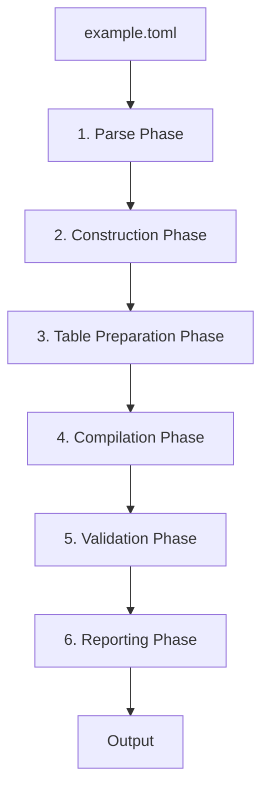
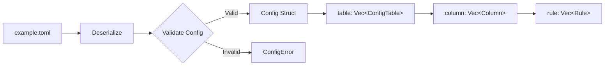
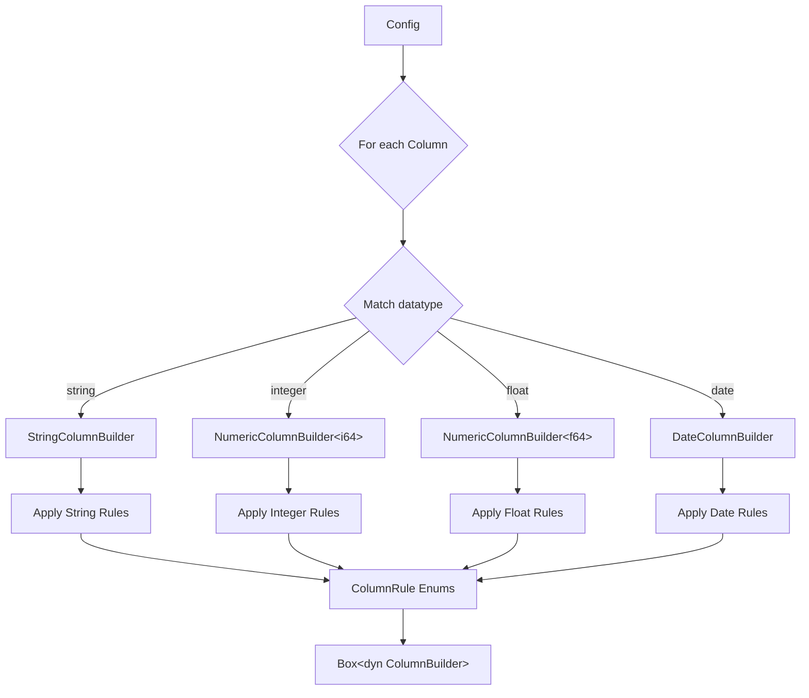
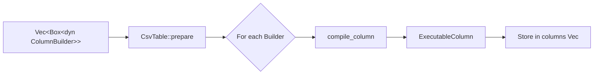
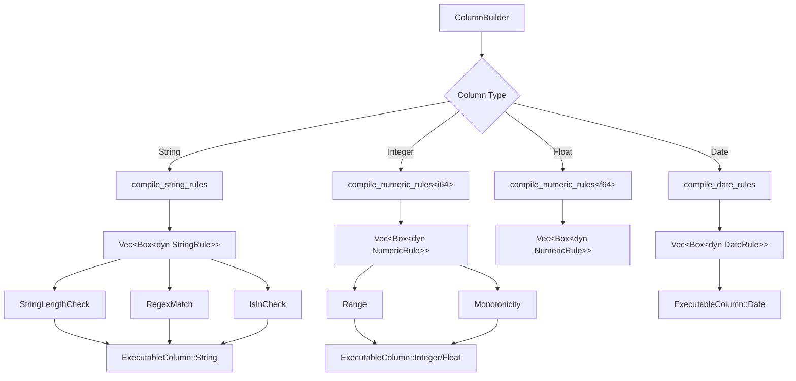
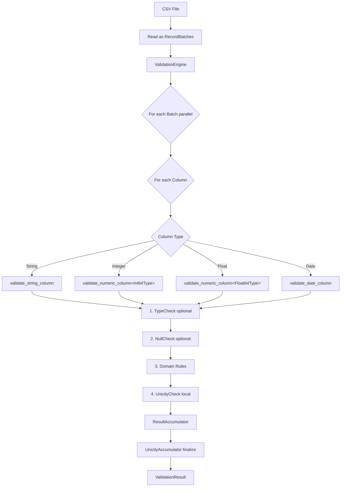
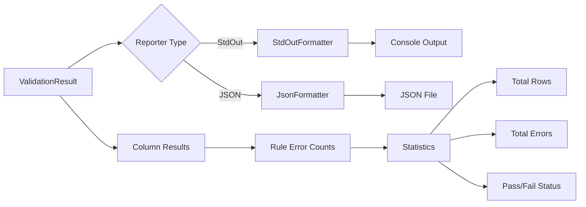
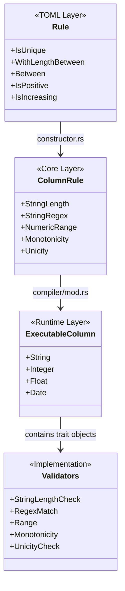

# TOML → Validation Pipeline

This document describes the complete flow from TOML configuration to validation results in DataGuard.

## Architecture Overview

## Detailed Flow

### 1. Parse Phase
**Location:** `crates/dataguard-cli/src/parser.rs`

**Responsibilities:**
- Deserialize TOML into strongly-typed Rust structs
- Validate config rules (e.g., `min < max`, file paths exist)
- Parse rule enums (IsUnique, WithLengthBetween, Between, etc.)

**Key Types:**
- `Config` - Root configuration
- `ConfigTable` - Table definition with name and path
- `Column` - Column definition with name, datatype, and rules
- `Rule` - Enum of all available validation rules

### 2. Construction Phase
**Location:** `crates/dataguard-cli/src/constructor.rs`

**Responsibilities:**
- Match TOML datatypes to appropriate builder types
- Apply rule methods to builders (e.g., `builder.is_positive()`)
- Translate TOML `Rule` enum to core `ColumnRule` enum

**Rule Translation Examples:**
- `Rule::IsPositive` → `builder.is_positive()` → `ColumnRule::NumericRange { min: Some(0), max: None }`
- `Rule::WithLengthBetween { min, max }` → `builder.with_length_between(min, max)` → `ColumnRule::StringLength { min, max }`
- `Rule::IsUnique` → `builder.is_unique()` → `ColumnRule::Unicity`

### 3. Table Preparation Phase
**Location:** `crates/dataguard-core/src/tables/csv_table.rs`

**Responsibilities:**
- Create `CsvTable` instance with path and name
- Call `prepare()` with column builders
- Internally calls the compiler for each builder

### 4. Compilation Phase
**Location:** `crates/dataguard-core/src/compiler/mod.rs`

**Responsibilities:**
- Compile regex patterns (for StringRegex rules)
- Build HashSets for membership checks (IsIn rule)
- Prepare numeric comparators (Range, Monotonicity)
- Separate domain rules from meta-rules (Unicity, NullCheck)
- Add TypeCheck for CSV tables (string → typed conversion)

**Key Optimizations:**
- Regex compiled once, not per-row
- HashSets built once for O(1) membership checks
- Trait objects enable polymorphic validation

### 5. Validation Phase
**Location:** `crates/dataguard-core/src/engine/validaton_engine.rs`

**Responsibilities:**
- Read CSV into Arrow RecordBatches
- Validate batches in parallel using Rayon
- Execute validation in strict order:
  1. **TypeCheck** - Convert strings to typed arrays (CSV only)
  2. **NullCheck** - Count null values
  3. **Domain Rules** - Execute type-specific validators
  4. **Unicity** - Build local hash sets per batch
- Finalize unicity across all batches (detect duplicates)
- Accumulate errors in thread-safe ResultAccumulator

**Key Features:**
- Parallel batch processing for performance
- Arrow arrays for zero-copy columnar access
- Atomic error counting across threads
- Global unicity tracking via UnicityAccumulator

### 6. Reporting Phase
**Location:** `crates/dataguard-reports/src/`

**Responsibilities:**
- Format validation results for output
- Support multiple output formats (stdout, JSON)
- Provide detailed error statistics per column/rule
- Show overall pass/fail status

**Output Includes:**
- Table name and file path
- Total rows processed
- Per-column error counts
- Per-rule error counts
- Overall validation status

## Key Data Structures

### Rule Hierarchy

## File References

| Phase | Module | Key Files |
|-------|--------|-----------|
| 1. Parse | `dataguard-cli` | `parser.rs:151` - `parse_config()` |
| 2. Construction | `dataguard-cli` | `constructor.rs:279` - `construct_csv_table()` |
| 3. Preparation | `dataguard-core` | `tables/csv_table.rs` - `CsvTable::prepare()` |
| 4. Compilation | `dataguard-core` | `compiler/mod.rs:181` - `compile_column()` |
| 5. Validation | `dataguard-core` | `engine/validaton_engine.rs:34` - `validate_batches()` |
| 6. Reporting | `dataguard-reports` | `formatters/` - `StdOutFormatter`, `JsonFormatter` |

## Supported Datatypes

| TOML Type | Builder | Arrow Type | Supported Rules |
|-----------|---------|------------|-----------------|
| `string` | `StringColumnBuilder` | `Utf8` | Length, Regex, Membership, IsUnique, IsNotNull, Alpha, Numeric, Email, URL, UUID |
| `integer` | `NumericColumnBuilder<i64>` | `Int64` | Range, Min, Max, Positive/Negative, Monotonicity, IsUnique, IsNotNull |
| `float` | `NumericColumnBuilder<f64>` | `Float64` | Range, Min, Max, Positive/Negative, Monotonicity, IsUnique |
| `date` | `DateColumnBuilder` | `Date32` | Before, After, NotPast, NotFutur, IsUnique, IsNotNull |
